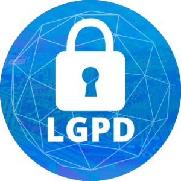

# CURSO DE LGPD
👨‍⚖️A LGPD (LEI GERAL DE PROTEÇÃO DE DADOS) É UMA LEI BRASILEIRA QUE ESTABELECE REGRAS PARA O TRATAMENTO E PROTEÇÃO DE DADOS PESSOAIS. ELA GARANTE MAIOR CONTROLE E PRIVACIDADE AOS INDIVÍDUOS EM RELAÇÃO AO USO DE SUAS INFORMAÇÕES.

  

## CONCEITO:
Dados pessoais são informações que permitem a identificação de uma pessoa natural, como nome, e-mail, telefone, CPF, RG, endereço, etc.

## EXEMPLOS:
* Nome: João da Silva
* E-mail: joao.da.silva@email.com
* Telefone: (11) 9999-9999
* CPF: 123.456.789-00
* RG: 123456789
* Endereço: Rua X, 123, Bairro Y, Cidade Z, UF

## IMPORTÂNCIA:
Os dados pessoais são importantes para a identificação de uma pessoa natural, o que pode ser usado para fins diversos, como marketing, vendas, atendimento ao cliente, etc.

## PROTEÇÃO:
Os dados pessoais devem ser protegidos contra o acesso, uso, divulgação, alteração ou destruição não autorizados.

## LGPD:
A LGPD define os dados pessoais como "informação relacionada a pessoa natural identificada ou identificável". A lei estabelece uma série de requisitos para o tratamento de dados pessoais, incluindo o consentimento do titular dos dados, a segurança dos dados e o direito do titular de acessar, corrigir ou excluir seus dados.

## ADEQUAÇÃO A LGPD:
Para se adequar à LGPD, as empresas que coletam e processam dados pessoais devem tomar medidas para proteger os dados e cumprir os requisitos da lei. Essas medidas podem incluir a implementação de políticas e procedimentos de segurança de dados, a obtenção do consentimento do titular dos dados e a transparência sobre a coleta e o uso de dados pessoais.

## EXEMPLOS PRÁTICOS:
* **Em um site de comércio eletrônico, o nome, e-mail e endereço do cliente são dados pessoais.**
* **Em um blog, os comentários dos usuários são dados pessoais.**
* **Em uma rede social, as informações do perfil do usuário, como nome, e-mail, foto e interesses, são dados pessoais.**

## CONCLUSÃO:
Os dados pessoais são informações importantes que devem ser protegidas. Ao se adequar à LGPD, as empresas podem garantir a proteção dos dados pessoais de seus clientes e usuários.

## SUBSIDIOS:
- [CURSO CRIADO PELO "CURSO EM VIDEO"](https://youtube.com/playlist?list=PLHz_AreHm4dlLcV0H86FKT1NVVkY71Q4Y&si=Xvt139KoVqrmPgEm)
- [CURSO FEITO PELO VILHALVA](https://github.com/VILHALVA)